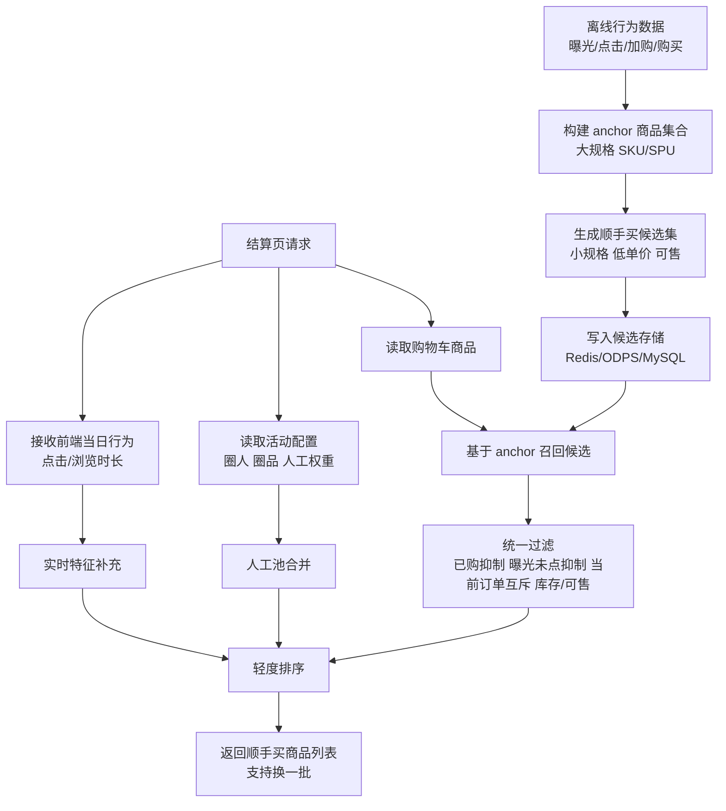

# 顺手买一件技术方案草图

## 1. 文档目标

基于最新业务规则，按新的方案方向整理一版可评审的技术方案草图，供业务、算法、商城研发一起对齐。

本文重点回答三件事：
- 顺手买一件的核心算法思路应该是什么
- 哪些能力适合离线做，哪些能力适合在线做
- 商城侧、算法侧、前端侧分别要补哪些能力

---

## 2. 需求收敛

## 2.1 核心业务规则
当前最核心的自动选品规则是两条：

1. 排序中优先推荐**用户购物车加购对应的小规格低单价商品**
2. 其次优先推荐**用户浏览时长较长商品对应的小规格低单价商品**

同时结合顺手买一件场景的其他约束：
- 展示场景：确认订单页
- 支持换一批
- 互斥当前订单已结算商品
- 一批最多展示 10 件
- 顺手买商品不参与当前订单优惠和门槛计算
- 某个顺手买 SKU 被购买后 7 天内不重复展示
- 商品当日曝光过且未点击，当天内不再展示
- 支持圈人 2.0、人工圈品、人工加权位
- 可关闭自动选品，完全走人工配置

## 2.2 结论
这不是一个“用户级猜你喜欢”问题，而是一个更明确的：

> 基于购物车商品和当日行为，从每个主购商品对应的“小规格低单价候选集”中，召回并排序出最适合顺手买的商品。

所以第一期最合适的方案不是“为每个用户离线生成推荐池”，而是：

> **离线 item-to-item 顺手买候选集 + 结算时基于购物车召回 + 当日行为轻度排序**

---

## 3. 方案总览

## 3.1 一句话方案

以“大规格 SKU / SPU”为 anchor，离线生成其对应的“小规格低单价顺手买候选集”；用户进入结算页时，基于购物车商品进行候选召回，再结合当日点击/浏览行为、人工加权和状态抑制做轻度排序。

## 3.2 核心取舍

### 不采用
- 第一阶段不给每个用户离线生成专属推荐池
- 第一阶段不上复杂在线模型
- 不让前端成为推荐计算主引擎

### 采用
- SPU/SKU 级 item-to-item 候选预计算
- 购物车驱动召回
- 前端回传当日行为作为实时特征补充
- 后端统一过滤、排序、裁决

---

## 4. 技术方案草图



---

## 5. 离线部分设计

## 5.1 anchor 定义
建议采用：
- **主方案：SPU 级 anchor**
- **补充方案：SKU 级 anchor**

原因：
- 顺手买的业务语义更接近“主购商品类型”而不是某个精细 SKU
- SPU 级更稳定，SKU 波动更小
- 对于鲜果或特殊非标商品，可补 SKU 级映射

## 5.2 离线候选生成逻辑
对每个 anchor 生成顺手买候选时，建议经过以下筛选：

### 基础筛选
- 小规格商品
- 低单价商品
- 当前区域/业态可售
- 遵守控价和活动规则
- 剔除不适合顺手买的商品

### 候选来源
建议至少融合三类信号：

1. **商品关联信号**
   - 共购关系
   - 同单出现频次
   - 类目互补关系

2. **行为信号**
   - 点击后加购转化率
   - 点击后购买转化率
   - 顺手买历史购买率

3. **运营信号**
   - 人工圈品池
   - 人工加权位
   - 特殊曝光位

## 5.3 离线产出结果形态
建议输出两类结果：

### 方案 A：基础候选集
```text
anchor_spu -> [candidate_sku1, candidate_sku2, ...]
```

### 方案 B：带特征候选集
```json
anchor_spu -> [
  {
    "candidateSku": "xxx",
    "baseScore": 0.82,
    "priceLevel": "low",
    "smallSpec": true,
    "source": ["cobuy", "manual_boost"]
  }
]
```

建议第一期优先用 **带基础特征的候选集**，避免在线阶段再做过多二次查询。

## 5.4 存储建议
第一期建议：
- Redis：承接在线读多写少的候选结果
- ODPS/MySQL：保存离线明细和回溯数据

Redis key 示例：
- `one_more:anchor_spu:{spuId}`
- `one_more:anchor_sku:{sku}`
- `one_more:manual_pool:{activityId}`

---

## 6. 在线部分设计

## 6.1 输入
结算页请求时，后端建议接收以下输入：

### 来自商城服务
- 当前购物车/结算商品列表
- 门店/商户信息
- 区域、业态、仓配信息
- 当前命中的活动信息

### 来自前端的当日行为补充
建议前端回传：
- 当日点击过的 SKU 列表
- 当日浏览时长较长的 SKU 列表
- 每个 SKU 的点击次数 / 停留时长（可选）

注意：
- 前端只提供**实时行为特征**
- 推荐召回和排序仍由后端完成
- 不建议把前端结果当成最终推荐答案

## 6.2 在线召回
在线召回分三步：

### 第一步：基于购物车商品召回
- 遍历购物车中的主购商品
- 读取每个 anchor 对应的顺手买候选集
- 合并去重

### 第二步：基于当日行为补召回
- 对前端传入的点击 SKU / 高停留 SKU，补召回其顺手买候选集
- 行为召回优先级低于购物车召回

### 第三步：人工池合并
- 若命中圈人活动，则合并圈品活动池
- 应支持多个活动同时命中
- 人工加权位在排序阶段体现，不一定直接强插

## 6.3 在线过滤
召回后的候选统一过滤：
- 过滤当前订单中已存在商品
- 过滤 7 天内已购买过的顺手买商品
- 过滤当天已曝光且未点击商品
- 过滤不可售、无库存、下架商品
- 过滤不符合价格/控价/活动条件商品
- 过滤超出单订单限购件数的商品

## 6.4 在线轻度排序
第一期建议采用规则打分，不上复杂模型。

建议打分项：

```text
score = 购物车关联分
      + 当日点击分
      + 当日浏览分
      + 小规格加分
      + 低单价加分
      + 人工权重分
      + 历史顺手买转化分
      - 曝光疲劳惩罚
```

### 建议排序优先级
1. 命中购物车商品关联的候选
2. 命中当日点击商品关联的候选
3. 命中当日高停留商品关联的候选
4. 同分情况下，小规格优先、低价优先、人工加权优先

## 6.5 换一批
“换一批”建议通过游标或分页实现：
- 同一次结算页会话内，避免重复返回已看过商品
- 每次换一批时从剩余候选中继续取
- 若候选不足，再降级补召回或结束展示

---

## 7. 人工配置与自动选品的关系

## 7.1 总体原则
顺手买一件必须支持两种模式并存：

### 模式 A：人工配置优先
- 活动完全由圈人圈品配置决定
- 自动选品可关闭

### 模式 B：人工 + 自动混合
- 人工活动池作为一部分候选来源
- 自动选品负责补足和排序

## 7.2 建议裁决顺序
建议按以下顺序裁决：
1. 先确定命中的人工活动池
2. 再补自动选品候选
3. 最后统一过滤与排序

这样既满足业务灵活性，也不会把自动策略做死。

---

## 8. 数据与状态设计

## 8.1 需要记录的用户状态
至少需要支持：
- 用户 7 天内已购买的顺手买 SKU
- 用户当天已曝光未点击的顺手买 SKU
- 当前结算会话内已经看过的 SKU

建议存储：
- Redis 状态集

示例：
- `one_more:bought_7d:{mId}`
- `one_more:exposed_not_clicked:{mId}:{yyyyMMdd}`
- `one_more:session_seen:{sessionId}`

## 8.2 埋点建议
第一期至少补齐以下埋点：
- 顺手买曝光
- 顺手买点击
- 顺手买换一批
- 顺手买勾选
- 顺手买下单
- 顺手买取消

关键字段建议：
- mId / 门店ID
- 活动ID
- 商品SKU
- anchorSku / anchorSpu
- 来源（购物车召回 / 点击召回 / 浏览召回 / 人工池）
- 排名位置
- 是否小规格
- 是否低单价
- 是否人工加权
- 实验桶

---

## 9. 接口草图

## 9.1 结算页顺手买查询接口
建议新增专用接口，而不是强行复用首页推荐接口。

### 入参建议
```json
{
  "settlementSessionId": "xxx",
  "cartSkuList": ["sku1", "sku2"],
  "clickSkuListToday": ["sku3", "sku4"],
  "browseSkuListToday": ["sku5"],
  "browseDurationMap": {
    "sku5": 120
  },
  "pageNo": 1,
  "pageSize": 10
}
```

### 出参建议
```json
{
  "activityTitle": "顺手买一件",
  "canRefresh": true,
  "items": [
    {
      "sku": "xxx",
      "source": "cart_anchor",
      "price": 9.9,
      "limitQty": 3,
      "smallSpec": true,
      "reason": "购物车商品关联的小规格低价商品"
    }
  ],
  "refreshToken": "token_xxx"
}
```

## 9.2 勾选顺手买商品接口
需要支持：
- 仅在结算态中生效
- 不写入普通购物车
- 独立参与结算明细展示

---

## 10. 与现有系统的关系

## 10.1 可复用能力
商城已有能力中，以下内容可直接复用或部分复用：
- 推荐结果 Redis 承接模式
- 商品详情拼装能力
- 可售库存校验
- 价格区间/低价筛选思路
- 已购买抑制实验经验
- AB 实验分析能力

## 10.2 需要新增能力
需要重点补齐：
- 顺手买专用候选池产出任务
- 顺手买专用在线查询接口
- 结算页专用“虚拟加购”处理
- 顺手买商品独立计价规则
- 曝光未点击抑制状态存储
- 换一批游标能力

---

## 11. 分阶段落地建议

## 11.1 Phase 1：可上线 MVP
目标：先做出可实验版本。

范围建议：
- anchor -> 候选集离线产出
- 购物车商品召回
- 前端当日点击/浏览列表回传
- 在线轻度排序
- 7 天购买抑制
- 当日曝光未点击抑制
- 人工活动池合并
- 顺手买专用接口
- 基础埋点

## 11.2 Phase 2：优化效果
- 引入更稳定的共购/互补特征
- 增强人工权重配置能力
- 优化换一批体验
- 做更细的分层 AB 实验

## 11.3 Phase 3：进一步算法化
- 引入用户价格敏感度
- 引入上下文感知排序
- 对高价值用户尝试用户级候选池
- 引入学习排序模型

---

## 12. 当前最值得优先对齐的问题

建议在评审时先对齐以下问题：

1. anchor 以 SPU 为主还是 SKU 为主
2. 小规格、低单价的业务定义口径是什么
3. 前端回传哪些实时行为字段，字段上限是多少
4. 顺手买商品独立计价如何接入结算链路
5. 人工池与自动池冲突时的优先级如何定
6. 多活动命中时展示去重规则如何定义
7. 当日曝光未点击抑制是否跨端共享

---

## 13. 最终建议

当前最合适的方案不是“用户级个性化离线推荐”，而是：

> **离线 item-to-item 顺手买候选集 + 结算页基于购物车召回 + 当日行为轻度排序 + 人工活动池融合**

这样做有三个好处：
- 最贴近当前业务规则
- 工程复杂度可控
- 能快速形成实验闭环，后续再逐步增强算法能力
